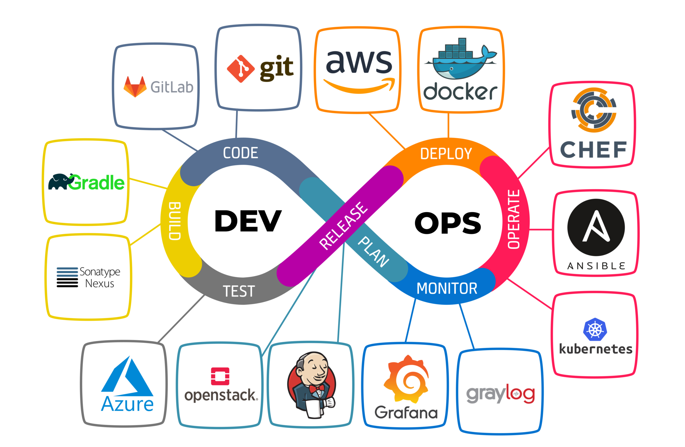

# What is DevOps?
DevOps is a culture, a way of work that an organissation needs to adopt that bridges the gap between development and operations. by briding the gap means, working in a cross-functional teams, able to communicate, collaborate, resolve issue etc..

# Life before DevOps and why it is needed...
Back in the days, we used to have two separate team, the development team and the operations team. The development team was only responsible for developing a product, once the product was developed the development team would run a demo of the product on their local machines and worked fine. However, when the product was passed to the operation team the product did not work. This meant that the product works locally but unavailable globally. Therefore, the end goal is that we are trying to make the product available globally. The operation team does the networking, put it on the cloud, lets make sure its secure etc.. so that it is user-friendly and accessible across the world. but when we deployed it, it didnt work. This is probably because the product was developed on windows, but it was deployed in linux, the environments did not match so it didnt work. So the operation team started accusing the development team for providing a faulty product so they send it back to the development team. However the development team's argument is that the product works which was shown in the demo. so they started blaming each other, this blame culture went on and on and on for a very long time. To eliminate this blame culture, DevOps came to existence. They came in with some knowledege with the development side of the business and some knowledge in operations side of the business. So we understand better the software development life cycle (SDLC). SDLC is Plan, Design, Develop, Test and Deploy. However, the testing part was missing, so the DevOps team tested the product. If it passes the test, the product is gonna work. This knowledge the operation team might not have. So DevOps bridged the gap and eliminated the blame culture out of the equation now the teams are working together, because DevOps has the knowldge on cross-functional teams.

# Why DevOps?
 It is a contineous process of improving efficiency and constant activity. DevOps allows the developer and the operation team to work together seamlessly so the teams can now deliver quickly and the deployments are more constant (faster release of software) 

# What are the benefits of DevOps?
 We help the business to coolaborate, work together, release the poduct(software) faster in a cost effective manner (if you save time you save cost). The blaming issue is resolved by creating a Virtual Environment for everyone to use, weather is development, testing or deployment whatever it may be. We create an environment called Developping Environment. So we all use the same environment, this is beneficial because no matter what device we use we gonna end up with the same results.

 # DevOps Principle
 - Work together
 - Share responsability
 - deploying Infrastructure as code
 - Automation

 # Engineering practices (CI/CD)
 - Continuous integration (bulidng products and writing test so the products works correctly)
 - Continuous delivery (engage with operation team 'development and pre-production')
 - Continuous deployment (running tests to production is called continuous deployment)

 # DevOps four key Pillars (cloud computing)
- Ease of use
- Flexibility (Agile, Scrum)
- RObustness (speed)
- Cost effective

>[Virtual Machine & Linux commands](virtual_machine.md) 