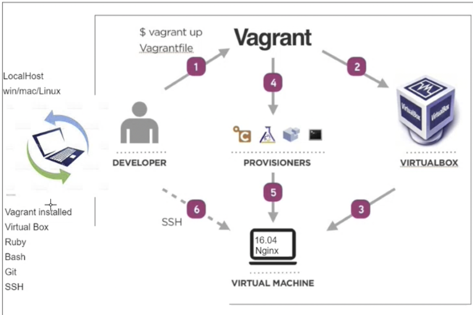

# Virtual Environment
- A Virtual Environment is an environment for everyone to use, weather is development, testing or deployment whatever it may be. We create this environmnet so that evryone has the same tool to collaborate together, this is beneficial because no matter what device we use we gonna end up with the same results.

- I used Vagrant to create a virtual environment through a vegrantfile, which was created in my local machine(host). In order for Vagrant to create a virtual machine I used VirtualBox, which all together provided information to the Virtual machine to run.



- Using `vagrant up` we create a VM in virtualBox. Using the Vagrantfile we instructed vagrant using the VirtualBox to create a VM. To enter the VM and see if the machine has internet connectivity as well as if we can deploy and install anything inside we do `vagrant ssh`. The VM is running inside VirtualBox and VirtualBox is running inside the local host. 

## how to set up internet on VM?

- to make sure that we have internet available from our local host
- `sudo apt-get update`. if this does not work, `exit` the vagrant and do `vagrant reload`
- `sudo apt-get upgrade`

## Vagrant file
- Create a vagrant file using `nano Vagrantfile` 
copy paste the following:
```bash
#Vagrantfile
Vagrant.configure("2") do |config|

# creating a virtual machine ubuntu 
 config.vm.box = "ubuntu/xenial64"

# Create a private network with provided ip address
 config.vm.network "private_network", ip: "192.168.10.100"

# "." means from my current location where this vagrant file is copy everything and paste it in the VM on the home location vagrant create a folder called app and paste everything
 config.vm.synced_folder ".", "/home/vagrant/app"
 
 
 # Provisioning
 config.vm.provision "shell", path:"environment/provision.sh" 

end
```

## Vagrant commands
- create a VM `vagrant up`
- check status `vagrant status`
- delete VM `vagrant destroy`
- pause `vagrant halt`
- To update `vagrant reload`
- How to access VM `vagrant ssh`


Whenever we add new functionality to our vagrant file that means we need to let the virtual box know there are new sets of commands so that it can implement those instructions inside the VM. There are two options we either do `vagrant up` followed by `vagrant destroy` so that it reboots with the newly added data or we can do `vagrant reload` which is quicker (if this doesn’t work use the other options). When we do vagrant reload, what happens is that vagrant goes to the local machine starts to read the vagrantfile pickup the ip address and tells virtualbox to inject this ip into this virtual machine to use the network available in the localhost.


## Bash scripting - Automate process with the script
### Code block to create in VM:

```bash
# create a file called provision.sh

# it must start with #!/bin/bash

#!/bin/bash

# run updates
sudo apt-get update -y
# run upgrades
sudo apt-get upgrade -y

# install nginx
sudo apt-get install nginx -y      

# ensure it's running - start nginx
sudo systemctl start nginx

# enable nginx
sudo systemctl enable nginx

#install git
sudo apt-get install git -y

#install nodejs
sudo apt install python-software-properties -y

curl -sL https://deb.nodesource.com/setup_6.x | sudo -E bash -

sudo apt install -y nodejs

# install pm2
# sudo npm installpm2 -g
#npm
cd  app/app

npm install

npm  start &

```
- change the file to exe `chmod +x provision.sh`
- how to run an exe file `sudo ./provision.sh`

### Reverse-Proxy:


```bash

server {
    listen 80;

    server_name _;

    location / {
        proxy_pass http://localhost:3000;
        proxy_http_version 1.1;
        proxy_set_header Upgrade $http_upgrade;
        proxy_set_header Connection 'upgrade';
        proxy_set_header Host $host;
        proxy_cache_bypass $http_upgrade;
    }
}
```

## Questions to ask developers when given app to deploy
- What are the dependencies (softwares or packages that need to be installed to run the app eg. python, nodejs etc..)
- How to run the tests (env test written in ruby), the ruby test which comands to use?
- 


restful api
incremental and iterative in agile
agile and scrum
high level programming language and a low level programming language